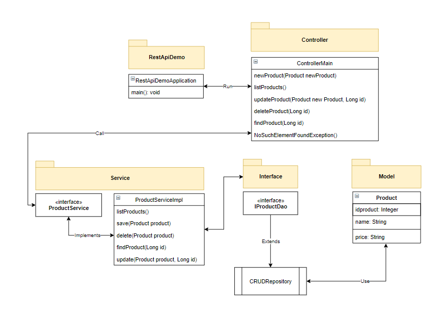

## :rocket: API Rest with SpringBoot and Mysql 

### :memo: Description
A simple API Rest with SpringBoot use for CRUD operations with the objetive to understand the workflow in SpringBoot applying
good practices and a clean code to separate logic.

### :sparkles: Features
A API Rest implementing a CRUD in Spring Boot using Java, Gradle and Mysql. The service implement bearer Jwt to autenthicate each request
It can be scaled to orchestrate service like Manager or Adapter (Architecture Patterns in backend). 

### :alembic: Core Concepts
- CRUD
- Rest API Service
- ModelViewController patron (MVC)
- Transactional Concept
- Logic Decoupling (Service Layer)

### :construction: Made with
- Thymeleaf
- Spring Data
- Spring JPA
- MySQL
- Spring DI(Dependency Injection) and AOP (Annotation)

### :hammer: Demostration
You can see a live video in: https://youtu.be/gKOzgdmAm3k
Or you can run locally the project with docker :whale:

- docker build -t spring-boot-app .
- docker-compose up

Ofcourse, here its the collection in postman to run the API. (assets/SpringMVCRestApplication.postman_collection)
It will start the app in the 8080 port, so download the postman app and test it!

*If you want to contribute to improve the project, please create your PR and write me :speech_balloon: . After it, sit down and take a beer, you deserve it!* :beers: .
*This project is for academic purposes only, all right reserved. Andrés Andrade 2021 :copyright::registered:*
  
